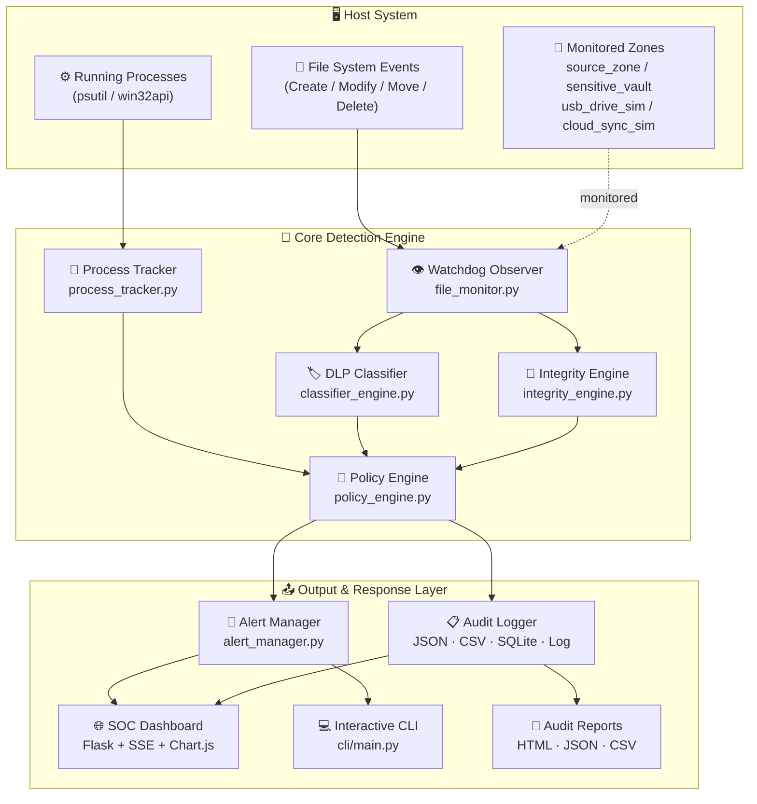
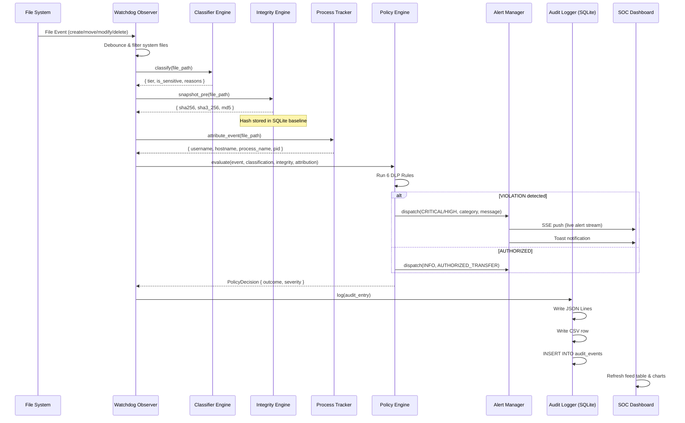
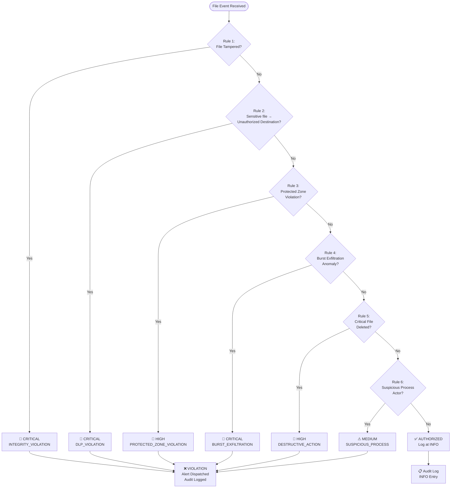
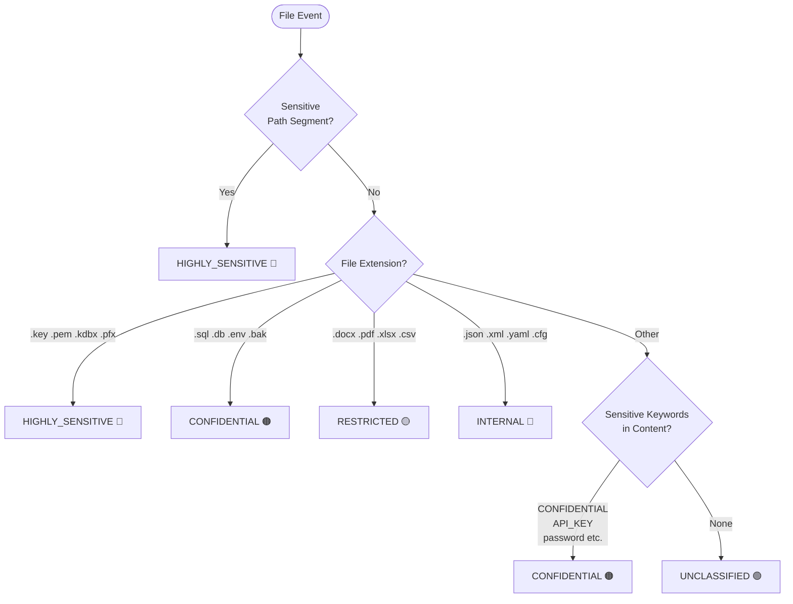
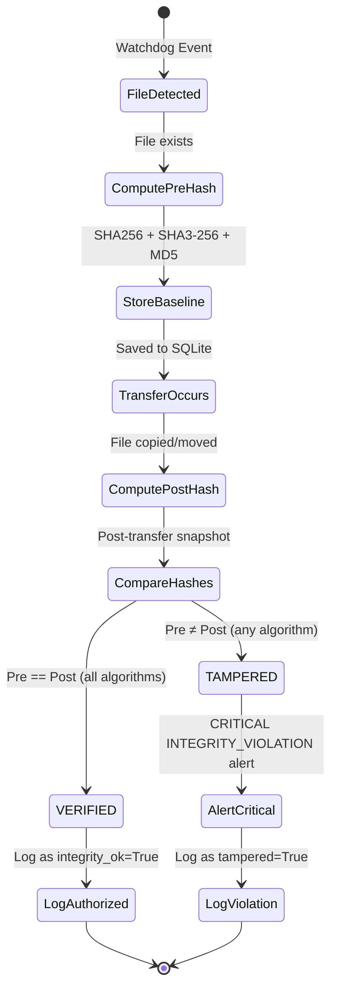
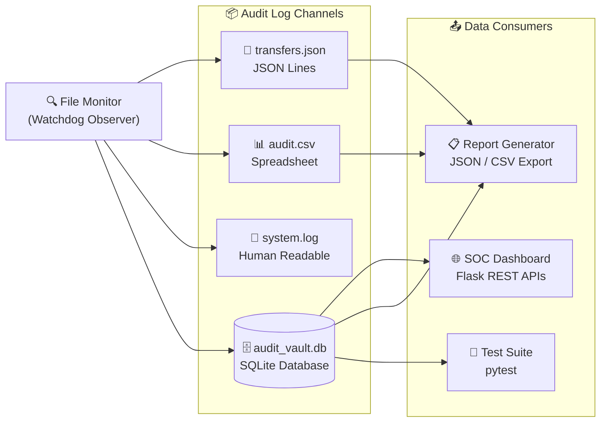

# Architecture Diagrams
## Secure File Transfer Monitoring System

---

## Diagram 1 — High-Level System Architecture

---

## Diagram 2 — File Event Processing Pipeline (Sequence Diagram)

---

## Diagram 3 — DLP Policy Rule Evaluation

---

## Diagram 4 — File Classification Decision Tree

---

## Diagram 5 — Integrity Verification Workflow

---

## Diagram 6 — Data Flow & Storage Architecture

